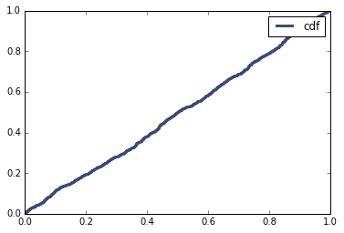
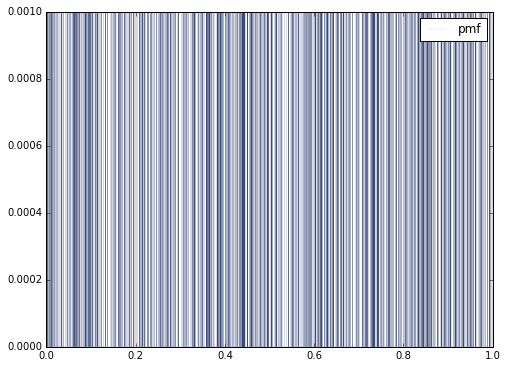

[Think Stats Chapter 4 Exercise 2](http://greenteapress.com/thinkstats2/html/thinkstats2005.html#toc41) (a random distribution)  
The following is the code I used to plot a CDF and PMF for 1000 numbers generated by random.random()

```python
%matplotlib inline
import random, thinkplot, thinkstats2
def random_dist():
    random_list = [random.random() for x in range(1000)]
    rand_cdf = thinkstats2.Cdf(random_list, label='cdf')
    thinkplot.Cdf(rand_cdf)
    thinkplot.Show()
    rand_pmf = thinkstats2.Pmf(random_list, label='pmf')
    thinkplot.pmf(rand_pmf, linewidth =0.1)
    thinkplot.Show()
random_dist()
```





If the distribution was perfectly uniform, then the CDF would be a straight line and the lines in the PMF would be distributed evenly. A sample size of greater than 1000 is necessary to ensure random.random() is generating numbers evenly.
