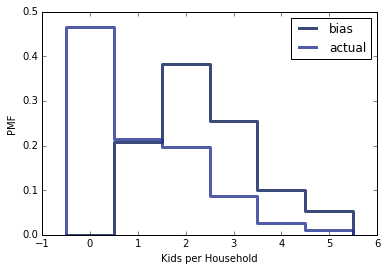

[Think Stats Chapter 7 Exercise 1](http://greenteapress.com/thinkstats2/html/thinkstats2008.html#toc70) (weight vs. age)

```python
%matplotlib inline
import nsfg, thinkstats2, thinkplot
import numpy as np
df = nsfg.ReadFemPreg()
df = df.dropna(subset=['agepreg','totalwgt_lb'])
age = df['agepreg']
weight = df['totalwgt_lb']
thinkplot.Scatter(age, weight)
thinkplot.Show(xlabel = "Mother's Age", ylabel = "Baby's Weight", axis = [10, 45, 0, 16])
```



```python
bins = np.arange(10,45,1)
indices = np.digitize(age, bins)
groups = df.groupby(indices)
ages = [group.agepreg.mean() for i, group in groups][1:-1]
cdfs = [thinkstats2.Cdf(group['totalwgt_lb']) for i, group in groups][1:-1]
for percent in [75,50,25]:
    weights = [cdf.Percentile(percent) for cdf in cdfs]
    label = '%dth' % percent
    thinkplot.Plot(ages, weights, label=label)
thinkplot.Show(xlabel = "Mother's Age", ylabel = "Baby's Weight")
```


For doing correlation analysis I am excluding hte areas of the data set where there are very few samples.
In this case less 16 and greater than 36.


```python
df2 = df[(df['agepreg'] > 15) & (df['agepreg']<37)]
age2 = df2['agepreg']
weight2 = df2['totalwgt_lb']
print("Pearson's correlation is {:4f}".format(thinkstats2.Corr(age2, weight2)))
print("Spearman's correlation is {:.4f}".format(thinkstats2.SpearmanCorr(age2,weight2)))
```

    Pearson's correlation is 0.078814
    Spearman's correlation is 0.0983


These correlations are both extremely close to 0, indicating that there is very little correlation between age and birth weight.


