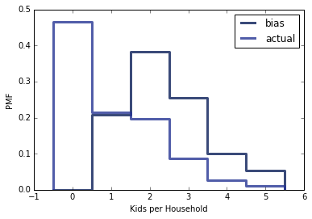

[Think Stats Chapter 8 Exercise 2](http://greenteapress.com/thinkstats2/html/thinkstats2009.html#toc77) (scoring)


```python
%matplotlib inline
import estimation, thinkstats2, random, math, thinkplot
import numpy as np
```

Using the Exponential Esitimator from Downey


```python
def RMSE(estimates, actual):
    """Computes the root mean squared error of a sequence of estimates.

    estimate: sequence of numbers
    actual: actual value

    returns: float RMSE
    """
    e2 = [(estimate-actual)**2 for estimate in estimates]
    mse = np.mean(e2)
    return math.sqrt(mse)

def Estimate3(n=7, m=1000):
    """Evaluates L and Lm as estimators of the exponential parameter.

    n: sample size
    m: number of iterations
    """
    lam = 2

    means = []
    medians = []
    for _ in range(m):
        xs = np.random.exponential(1.0/lam, n)
        L = 1 / np.mean(xs)
        Lm = math.log(2) / np.median(xs)
        means.append(L)
        medians.append(Lm)
    cdf = thinkstats2.Cdf(means)
    ci = cdf.Percentile(5), cdf.Percentile(95)
    #print('n =', n)
    #print('Standard Error = {:.4f}'.format(RMSE(means, lam)))
    #print('Confidence interval = [{:.3f},{:.3f}]'.format(ci[0],ci[1]))
    return RMSE(means, lam)
```


```python
ns = [10,25,50,100,250,500,750,1000]
error = [Estimate3(n=x) for x in ns]
thinkplot.Plot(ns,error, label = 'RMSE')
thinkplot.Show(xlabel = 'n', ylabel = 'Standard Error')
```



```python
Estimate3(n=10)
Estimate3(n=100)
Estimate3(n=1000)
```

    n = 10
    Standard Error = 0.7994
    Confidence interval = [1.263,3.655]
    n = 100
    Standard Error = 0.2098
    Confidence interval = [1.709,2.376]
    n = 1000
    Standard Error = 0.0605
    Confidence interval = [1.904,2.104]


As N increases, the error decreases and the confidence interval becomes tighter
